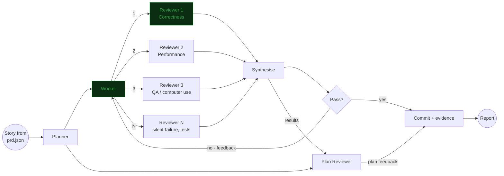

# LiteAPI v2 — Postman-switchable, modernized, faster

> Machine-executable improvement program. Written to be driven by the Ralph loop with an
> orchestrator, a resident worker, parallel ephemeral reviewers, and a computer-use QA reviewer.
> Humans can read it top-to-bottom; agents should read §4 (protocol) and §7 (backlog) only.

---

## 1. Purpose

Make a Postman user able to switch to LiteAPI in an afternoon, make the app measurably faster than
Postman, and move the codebase onto modern Go/Svelte idiom — without regressing the Bruno parity
already banked in `PARITY.md`.

---

## 2. Verified baseline (2026-07-25)

| Gate | Result |
|---|---|
| `go build ./...` | pass |
| `go vet ./...` | pass, clean |
| `go test ./...` | pass — 456 tests, 23.2s |
| `npm run check` (svelte-check) | 0 errors, 0 warnings |
| Bundle | **1.16 MB** single JS chunk + 114 KB CSS |
| Size | `app.go` 42,532 lines / 1,601 funcs / 181 types · `App.svelte` 13,165 lines / 229 state vars / 665 funcs / 30 inlined modals |
| Bindings | 167 Wails methods, **90 return the whole `AppState`** |

### 2.1 Evidence — why this program exists

**A. Wrong reference product for the goal.** `PARITY.md:3` names Bruno authoritative;
`docs/ux/2026-07-19-pre-implementation-audit.md:406` lists "copy Postman" as an explicit non-goal.

- `pm.*` is **not a runtime API**. It is a string-replacement table applied at import time only
  (`postmanTranslateScript`, `app.go:36734`). A pasted Postman script does not run.
- That table is semantically lossy: `pm.environment.set`, `pm.collectionVariables.set`,
  `pm.globals.set` and `pm.variables.set` **all collapse to `bru.setVar`** (runtime scope) at
  `app.go:36739–36754`.
- Absent entirely: request History, runner iterations, runner data files (0 hits for `csv`/`dataFile`),
  mock server, `pm.visualizer`, HAR import.
- Dynamic variables: only `{{$timestamp}}` and `{{$isoTimestamp}}` (`app.go:30936`).
- Code generation: only `curl` and `fetch` (`app.go:4111`). Postman ships ~20 targets.

**B. The keystroke path is pathological.** `UpdateRequest` (`app.go:3363`) — fired on every keystroke
from `patchRequest` (`App.svelte:5338`) — takes one global exclusive mutex, then:

1. `persistLocked` (`app.go:8393`) `json.MarshalIndent`s the **entire** app state and `os.WriteFile`s
   it synchronously. 83 call sites. Non-atomic: a crash mid-write corrupts `state.json`.
2. `AppState` reaches every cached response body via `RequestItem.Response` (`app.go:379`), and
   `Response` stores each body **twice** — `Body` + `BodyBase64` (`app.go:631–632`). A 5 MB response
   occupies ~11.7 MB and is re-serialized on every keystroke.
3. The same full state crosses the Wails bridge; the frontend replaces `state` wholesale, invalidating
   ~90 `$:` statements.

Supporting cast:

| Issue | Location |
|---|---|
| Transports `Clone()`d per request → empty connection pool whenever proxy/client-cert/custom-CA/verify-off applies | `cloneHTTPTransport` `app.go:9546`; even `transportWithoutProxy` `app.go:9557` clones |
| 25 JS shims `RunString`'d fresh, up to 4× per request, no `*goja.Program` cache | `newScriptRuntimeWithMeta` `app.go:17274` |
| Saving one request rewrites the **entire collection** to disk | `writeCollectionFilesLocked` `app.go:32023`, 25 call sites |
| `interpolate` = up to 8 passes × every var × `ReplaceAll` over the whole string, per header/param/body | `app.go:30920` |
| One global `sync.Mutex`, 112 `Lock()`, **zero `RLock`**; `GetState` takes the write lock | `app.go:134`, `app.go:1386` |
| WS/gRPC live sessions polled; each poll re-marshals the whole event log → O(n²) | `app.go:10881`; only 3 `EventsEmit` in the entire codebase |
| Unbounded `io.ReadAll` on response bodies | `app.go:9190` |
| Linear scans in runner loops (`findCollectionLocked`, `findItem`) | no ID→index maps |

**C. Modern in name only.**

| Metric | Value |
|---|---|
| Runes (`$state`/`$derived`/`$effect`/`$props`) across 15 components | **0** |
| `export let` / `$:` / stores / context | 165 / 174 / 0 / 0 |
| `{#each}` keyed | 13 of 106 (12%), no virtualization anywhere |
| Per-keystroke full-document `TextEncoder().encode()` | `CodeEditor.svelte:42` |
| PR CI / linter / benchmarks | none / none / **0 `func Benchmark`** |
| Frontend tests | 7 cases / 136 lines, **not wired to any npm script** |

### 2.2 Protected — must not regress

- `frontend/src/lib/workbench/response.ts` — tiered guarding (128 KB auto / 512 KB embedded / 1 MB full)
  with UTF-8-boundary-correct and Base64-quartet-correct slicing. Best module in the repo; it becomes
  the **client** of the new body-handle API, not a casualty of it.
- `frontend/src/style.css` — 74 semantic color tokens, 12 named themes, `prefers-reduced-motion` and
  `prefers-contrast` support.
- Accessibility in `App.svelte` — 239 `aria-label`, real focus traps, `inert` modal blocking,
  `returnFocus` capture/restore, roving tabindex, 209 `data-testid`.
- The 456 Go tests, and the in-code `Feature` ledger at `app.go:42331` (extend, never drop).

---

## 3. Orchestration model



**Green = resident** (context preserved across feedback rounds, continued via `SendMessage`).
**White = ephemeral** (fresh `Agent` call each round — fresh eyes, no anchoring).

| Role | Residency | Agent type | Job |
|---|---|---|---|
| Planner | ephemeral | `Plan` | Read story + repo, emit `.ralph/plans/US-XXX.md`. One plan per story, never per round. |
| **Worker** | **resident** | `general-purpose` | Implement. Runs standing gates before declaring done. Keeps context across rounds so feedback lands in situ. |
| **Reviewer 1 — Correctness** | **resident** | `feature-dev:code-reviewer` | Regression + convention. Resident so it can say "you did not fix what I flagged in round 1." |
| Reviewer 2 — Performance | ephemeral | `general-purpose` | `go test -bench` vs `.ralph/baseline/`; assert no full-state marshal / sync disk write / full-state bridge payload on the hot path. |
| Reviewer 3 — QA | ephemeral | `general-purpose` + chrome MCP | Drive the running app, screenshot, trace. §5.3. |
| Reviewer 4 — Silent failures | ephemeral | `pr-review-toolkit:silent-failure-hunter` | Swallowed errors, bad fallbacks. High value given 83 `persistLocked` sites becoming async. |
| Reviewer 5 — Tests | ephemeral | `pr-review-toolkit:pr-test-analyzer` | Coverage of the new behavior, not just the happy path. |
| Synthesise | ephemeral | `general-purpose` | Dedup + rank reviewer output into one verdict. Blocking findings only; nits → `.ralph/backlog.md`. |
| Plan Reviewer | ephemeral | `Plan` | Receives plan **and** synthesised results. Re-scopes or splits remaining stories in `prd.json` when the plan proved wrong. |

**Reviewer selection is per-story, not fixed.** Minimum R1. Add R2 for anything in Phase 1, R3 for
anything with a UI surface, R4 for anything touching error paths, R5 for anything with new logic.
Each story in §7 names its required reviewers.

---

## 4. Loop protocol

### 4.1 State files

```
prd.json                      # Ralph backlog — generated from §7
progress.txt                  # Ralph append-only run log
.ralph/plans/US-XXX.md        # Planner output, one per story
.ralph/reviews/US-XXX-round-N.md   # Synthesise output, one per round
.ralph/backlog.md             # deferred non-blocking nits
.ralph/blocked/US-XXX.md      # escalation after 3 failed rounds
.ralph/baseline/bench.txt     # go test -bench baseline (from US-005)
.ralph/baseline/bundle.txt    # dist size baseline
.ralph/baseline/*.png         # QA reference screenshots
```

### 4.2 Per-story sequence

1. **Plan** — dispatch Planner. Write `.ralph/plans/US-XXX.md`. In the same message, seed Plan Reviewer
   with the plan (it parks until step 5).
2. **Implement** — dispatch resident Worker with story + plan. Worker runs standing gates (§5.1) and
   reports diff + gate output. Worker never self-accepts.
3. **Review — fan out in ONE message, multiple `Agent` calls.** All reviewers run in parallel against
   the same working tree. Round 1 creates R1; rounds 2+ continue R1 via `SendMessage` and create fresh
   R2..RN.
4. **Synthesise** — one verdict: `PASS` or `FAIL` + ranked blocking findings with `file:line`.
5. **Gate** —
   - `FAIL` → `SendMessage` findings to the **resident** Worker. Round++. Back to step 3.
   - **Max 3 rounds.** On the 3rd `FAIL`, write `.ralph/blocked/US-XXX.md`, leave `passes: false`,
     move to the next story. Do not burn the loop.
   - `PASS` → step 6.
6. **Plan feedback** — hand synthesised results to Plan Reviewer. It may edit `prd.json`: split a
   story that proved too big, reorder on a discovered dependency, or add a story for scope that
   surfaced. This is the only sanctioned mid-run edit to `prd.json`.
7. **Finalise** — commit on `ralph/<feature>`, append to `progress.txt`, set `passes: true`.

### 4.3 Cross-story parallelism

Stories may run concurrently in isolated worktrees (`isolation: "worktree"`) **only** when their file
sets are disjoint.

| Lane | Files | Concurrency |
|---|---|---|
| Backend | `app.go` + Go satellites | **Serial.** Everything touches `app.go`; parallel = permanent conflict. |
| Frontend | `frontend/src/**` | Parallel with Backend. Internally serial once the store layer (US-026) lands. |
| Tooling | `.github/`, configs, `qa/` | Parallel with both. |

Phase 0 must complete before anything else — it is the measurement and safety net the rest depends on.

---

## 5. Commands

### 5.1 Standing gates — every story, non-negotiable

```sh
go build ./...
go vet ./...
go test ./...
go test -race ./...
cd frontend && npm run check && npm run build && npm test
```

Add for Phase 1 stories:

```sh
go test -bench=. -benchmem -run=^$ ./... | tee .ralph/reviews/US-XXX-bench.txt
# compare against .ralph/baseline/bench.txt — no regression >5% on any benchmark
```

Add for stories changing the bundle:

```sh
du -b frontend/dist/assets/*.js frontend/dist/assets/*.css | tee -a .ralph/reviews/US-XXX-bundle.txt
```

### 5.2 Run the loop

```sh
# one-time: generate prd.json from §7
# (invoke the ralph-loop skill against this file)

# full autonomous run
/ralph-loop:ralph-loop

# cancel
/ralph-loop:cancel-ralph
```

Manual single-story drive, if not using Ralph:

```
Execute US-XXX from improvement_v2.md using the §4.2 protocol.
Planner → resident Worker → parallel reviewers (per the story's Reviewers column)
→ Synthesise → Pass gate (max 3 rounds) → Plan Reviewer → commit.
```

### 5.3 Computer-use QA (Reviewer 3)

The Wails dev server exposes the real app with live Go bindings in a browser — this is what makes
automated QA possible without a native driver. `PARITY.md` already records this as the "Wails dev
browser smoke" method.

```sh
wails dev          # app at http://localhost:34115
```

Reviewer 3 then, via MCP:

- `mcp__claude-in-chrome__*` — navigate to `http://localhost:34115`, drive the UI, `gif_creator` for
  multi-step flows, `read_console_messages` for errors. Load the tool set in **one** `ToolSearch` call.
- `mcp__chrome-devtools__performance_start_trace` / `performance_stop_trace` — required for every
  Phase 1 and Phase 2 story. Assert: no long task on keystroke, virtualized DOM node count.
- `take_screenshot` → diff against `.ralph/baseline/*.png`.

**Never** trigger `alert`/`confirm` dialogs — they block the extension and kill the session.

For native-package QA, build and drive the real bundle:

```sh
wails build -nocolour && open build/bin/LiteAPI.app
```

### 5.4 Perf fixture

```sh
go run ./qa/responsefixture      # deterministic 1 MiB / 5 MiB / binary / SSE / WS / gRPC payloads
go run ./qa/platformfixture      # loopback HTTP / proxy / HTTPS / mTLS listeners
```

---

## 6. Definition of done (every story)

- [ ] All standing gates green, output pasted into the review file
- [ ] Story acceptance criteria each individually demonstrated
- [ ] Synthesise verdict `PASS`
- [ ] No new `svelte-check` warning, no new `go vet` finding
- [ ] Protected assets (§2.2) verified intact where touched
- [ ] Committed on `ralph/<feature>` with the story ID in the subject

---

## 7. Backlog

Ordered by dependency. `R` = required reviewers beyond R1 (R1 is always required).
Every story additionally carries `"Typecheck passes"`; UI stories carry
`"Verify in browser using browser tools"`.

### Phase 0 — Guardrails (blocks everything)

| ID | Story | Key acceptance criteria | R |
|---|---|---|---|
| US-001 | PR CI workflow | New `.github/workflows/ci.yml` on `pull_request` runs test, `-race`, vet, check, build, npm test. Fails on a deliberately broken PR. | — |
| US-002 | Wire frontend tests | `frontend/package.json` gains `"test": "node --test test/*.mts"`. Existing 7 cases pass via `npm test`. | 5 |
| US-003 | Go linter | `.golangci.yml` with `govet, staticcheck, errcheck, ineffassign, unused`. CI step added. Repo passes or violations are explicitly excluded with a reason. | — |
| US-004 | Frontend linter | `eslint.config.js` + `eslint-plugin-svelte`. `npm run lint` passes. | — |
| US-005 | Benchmarks | `bench_test.go` benchmarks `persistLocked`, `writeCollectionFilesLocked`, `interpolate`, `newScriptRuntimeWithMeta`, `executeHTTP`. Output committed to `.ralph/baseline/bench.txt`. | 2 |
| US-006 | Large-workspace fixture | Generator produces 500 requests / 10 collections, ≥3 with 5 MB cached responses. Used by US-005 benchmarks. | 2 |
| US-007 | Resolve Wails pin | CI pins `v2.10.2` (`release.yml:16`); QA docs record `v2.12.0`. `go.mod` and CI agree on one version; `wails build` succeeds. | — |

### Phase 1 — Backend performance (serial; all touch `app.go`)

| ID | Story | Key acceptance criteria | R |
|---|---|---|---|
| US-008 | `AppState.Revision` | `Revision int64` added, monotonically bumped on every mutation. Existing tests pass. | — |
| US-009 | Response body store | `responseStore`: in-memory LRU + spill to `<dataDir>/responses/`. `Response.Body`/`BodyBase64` → `BodyHandle` + `Size` + inline head (~8 KB). **`BodyBase64` deleted.** Versioned `state.json` migration following `workspace_migration.go`. | 2,4,5 |
| US-010 | `ReadResponseBody` binding | Returns raw + base64 for `(handle, offset, length)`. `response.ts` "Render full" (`ResponseInspector.svelte:231`) and "Load more" (`:233`) call it. Tiered limits unchanged. | 2,3,5 |
| US-011 | Bound response reads | `io.ReadAll` at `app.go:9190` replaced with `io.LimitReader` (default 100 MB, configurable) + stream-to-spill above threshold. 50 MB fixture response: RSS does not grow ~2.3× body size. | 2,4 |
| US-012 | Async coalesced persistence | 83 `persistLocked()` calls → `a.markDirty(scope)`. Background writer, ~250 ms debounce, force-flush on `beforeClose`/`shutdown`/blur. `json.Marshal` not `MarshalIndent`. Temp + `os.Rename`. **Kill mid-write → `state.json` still parses.** | 2,4,5 |
| US-013 | Split dirty scopes | `state.json`, `secrets.json`, OAuth2 token file get independent dirty flags; unchanged files are not rewritten or re-encrypted. | 4 |
| US-014 | Narrow-return mutators | `UpdateRequest`, `UpdateOpenTabPanes`, `SetActiveTab`, `MoveOpenTab` gain variants returning `{Revision, Item}` / `{Revision, Tabs}`. Frontend applies locally; `GetState()` only on boot, watcher change, or revision gap. | 2,3 |
| US-015 | Dirty-set collection writes | `writeCollectionFilesLocked` writes only changed request/env files (hash-compare). Saving one request no longer rewrites the collection. Bru/YAML round-trip tests pass. | 2,5 |
| US-016 | Transport cache | Keyed `map[string]*http.Transport` (key: TLS settings, matched client cert, proxy resolution, verifyTLS) behind `RWMutex`, idle eviction. **Proof: `qa/platformfixture` with proxy + client cert, N sequential sends, one TCP connection.** | 2,5 |
| US-017 | Consolidate clients | Six one-off `http.Client{Timeout: 30s}` (`app.go:14246, 15777, 15878, 16137, 16238, 19068`) use the US-016 cache. | 2 |
| US-018 | goja program cache | 25 shim sources compiled once via `goja.Compile` behind `sync.OnceValue`; `RunProgram` per runtime. `newScriptRuntimeWithMeta` benchmark improves ≥5×. All ~60 JS-runtime tests pass. | 2,5 |
| US-019 | goja runtime pool | `sync.Pool` of pre-warmed runtimes; one runtime instead of four where hooks share scope (`app.go:17055–17229`). Sandbox mode isolation preserved — safe mode still strips `process`/`fs`. | 2,4,5 |
| US-020 | `RWMutex` | `a.mu` → `sync.RWMutex`; read-only paths incl. `GetState` (`app.go:1386`) use `RLock`. `go test -race` clean. | 2,4 |
| US-021 | WebSocket event push | Incremental `ws:event` via `EventsEmit`; frontend appends. Poll-and-re-marshal (`app.go:10881`) removed. | 2,3 |
| US-022 | gRPC event push | Same for `grpc:event`. Streaming tests + Timeline counts unchanged. | 2,3 |
| US-023 | Single-pass interpolate | `interpolate` (`app.go:30920`) → one regex scan + one `strings.Builder`. Precedence from `buildVariableMap` (`app.go:30115`) unchanged. Benchmark improves ≥10× at 50 vars. | 2,5 |
| US-024 | Lookup index maps | ID→index maps for `findCollectionLocked`/`findItem`/`findItemInState`. Runner over 500-request fixture no longer quadratic. | 2 |

### Phase 2 — Frontend (parallel lane with Phase 1)

| ID | Story | Key acceptance criteria | R |
|---|---|---|---|
| US-025 | Extract modals | The 30 `role="dialog"` blocks at `App.svelte:11852–13165` (~1,300 lines) become components under `lib/modals/`. Focus traps, `inert`, `returnFocus`, `aria-modal` all intact. | 3 |
| US-026 | Store layer | `.svelte.ts` rune modules: `workspaceStore`, `requestStore`, `responseStore`, `devToolsStore`, `uiStore`. `WorkspaceCommandBar`'s 22 flattened props (`App.svelte:8390–8413`) and `KeyValueTable`'s 33 collapse to store reads. | 3,5 |
| US-027 | Runes — `lib/` | 5 components migrated: `export let`→`$props()`, `bind:`→`$bindable`. svelte-check stays 0/0. | 3 |
| US-028 | Runes — `workbench/` | 9 components migrated, incl. `ResponseInspector.svelte`'s 42 `$:`. | 3 |
| US-029 | Runes — `App.svelte` | 110 `$:` migrated. **Five non-mechanical spots handled explicitly:** self-referential filter `:1006`; DOM `.indeterminate` write `:1011`; `applyThemeToDocument`/`applyZoom`/`applyCodeFont` side effects `:1091, 1126–1128`; `<svelte:fragment slot>` `:8415, 8778` → snippets. | 3,4 |
| US-030 | Key every `{#each}` | All 106 keyed. Priority: tree `:8177, 8211, 8282`, tab bar `:8439`, console `:8496`, network log `:8559`. | 3 |
| US-031 | Virtualize tree | Collection tree virtualized. 500-request fixture: DOM node count bounded (each row currently renders 15–20 nodes). Keyboard nav + context menus still work. | 3 |
| US-032 | Virtualize network log | DevTools network log virtualized; `aria-sort`, column widths, filters preserved. | 3 |
| US-033 | CodeEditor per-keystroke | `CodeEditor.svelte:42` full-document `TextEncoder` encode → incremental length from the CodeMirror transaction. `variableSignature` (`:44–45`) memoized on a stable key. 500 KB body: no per-keystroke half-MB allocation. | 2,3 |
| US-034 | Memoize derivations | `variableTooltipsForRequest` (`App.svelte:1104`→`:1454`) memoized on request id+revision. `groupedItems` (`:8178`) → `$derived` on collection revision. Network-log filter/sort (`:1082, 1084`) computed once. | 2,3 |
| US-035 | Debounce `patchRequest` | `App.svelte:5338` debounced ~120 ms with optimistic local state. Disk autosave (`:6213`) unchanged. No lost keystroke on rapid typing then immediate Send. | 2,3 |
| US-036 | Bundle splitting | `vite.config.ts` gains `manualChunks`; DevTools, Runner, Import, Preferences, OpenAPI-sync, CodeMirror dynamically imported. Initial chunk **< 500 KB** (from 1.16 MB). | 2,3 |
| US-037 | Spacing + type tokens | `--space-*`, `--font-size-*`, `--radius-*` added; the 1,183 raw `px` literals migrated. 12 themes render identically (screenshot diff). | 3 |
| US-038 | Test `response.ts` | Vitest + `@testing-library/svelte`. `response.ts` (201 lines, currently untested) covered: UTF-8 boundary slicing, Base64 quartet alignment, hex dump, bounded diff, match cap. | 5 |

### Phase 3 — Postman migration-grade compatibility

| ID | Story | Key acceptance criteria | R |
|---|---|---|---|
| US-039 | `pm` core | Live `pm` object in goja beside `bru`. `pm.test`, `pm.expect` (existing Chai shim), `pm.info` (request name, iteration index/count). | 4,5 |
| US-040 | `pm` variable scopes | `pm.environment.*`→`bru.get/setEnvVar`; `pm.collectionVariables.*`→collection scope; `pm.globals.*`→global env; `pm.variables.*`→resolved chain. **Each scope distinct — this is the bug in the import table.** | 4,5 |
| US-041 | `pm.request` / `pm.response` | Backed by existing `req`/`res` (`app.go:17420, 17482`). Incl. `responseTime`, `responseSize`, `pm.response.to.have.*`. | 5 |
| US-042 | `pm` side effects | `pm.sendRequest`→`bru.sendRequest`; `pm.cookies`→`bru.cookies`; `pm.execution.setNextRequest`→`bru.setNextRequest` (`app.go:17712`). | 4,5 |
| US-043 | `pm.iterationData` / `pm.vault` | `iterationData` from US-046; `vault` onto the existing `secrets.json` layer. | 4,5 |
| US-044 | Fix + demote translator | `postmanTranslateScript` (`app.go:36734`) scope collapse fixed (`:36739–36754`). Becomes **opt-in**; default is native `pm.*`. | 5 |
| US-045 | Runner iterations | `RunnerOptions` (`app.go:1133`) gains `Iterations int`. Per-iteration rows in `RunnerSnapshot`. | 3,5 |
| US-046 | Runner data files | `DataFile string`; CSV and JSON parsed; each row bound to `pm.iterationData` and `{{var}}` interpolation. | 3,5 |
| US-047 | Runner bail | `BailOnFailure bool` short-circuits the run; result rows mark unrun requests. | 5 |
| US-048 | History store | Persisted, capped, searchable send history stored **outside `state.json`**, reusing the US-009 body store. Bindings for list/search/get/clear. | 2,4,5 |
| US-049 | History sidebar | UI surface with filter, "open in tab", "save to collection". | 3 |
| US-050 | Dynamic variables | Postman's common set beyond the existing 2 (`app.go:30936`): `$guid`, `$randomUUID`, `$randomInt`, `$randomFirstName`, `$randomEmail`, `$randomIP` + ~35 more. | 5 |
| US-051 | HAR import | HAR → collection. Registered in `detectCollectionImport` (`collection_import.go:538`). Fixture added to `docs/qa/import-fixtures/`. | 5 |
| US-052 | Swagger 2 import | Currently rejected (`collection_import.go:553`). Convert to OpenAPI 3, then reuse the existing importer. | 5 |
| US-053 | Postman export fidelity | `ExportCollectionWithOptions` (`app.go:7432`) round-trips HTTP/GraphQL losslessly incl. `event` blocks and auth. Import→export→import is idempotent. | 5 |
| US-054 | Code generation targets | Beyond `curl`/`fetch` (`app.go:4111`): Python `requests`, Node `axios`, Go, Java, C#, PHP, Ruby, HTTPie, PowerShell. | 3,5 |
| US-055 | Command palette | `Cmd+Shift+P`, distinct from existing `Cmd+K` object search. Specified at `docs/ux/2026-07-19-pre-implementation-audit.md:153`, never built. | 3 |
| US-056 | Bulk edit | Text-mode toggle for headers/params tables (Postman muscle memory). Round-trips to rows without losing disabled state. | 3 |
| US-057 | Postman keybinding preset | Selectable preset layered on the existing customizable keybinding system; collisions still rejected. | 3 |
| US-058 | Visualizer | `pm.visualizer.set(template, data)` + a response Visualizer tab rendering in a **sandboxed iframe with strict CSP**. | 3,4 |
| US-059 | Postman parity ledger | `POSTMAN-PARITY.md` in the same evidence style as `PARITY.md`. `Feature` ledger (`app.go:42331`) gains Postman rows. **Bruno ledger retained.** | — |

### Phase 4 — Structured decomposition

`app.go` → packages, behind the 456 existing tests, one package per story. `App` becomes a thin Wails
façade — the shape `git_workbench.go` and `workspace_service.go` already model. Stories marked ⚑ are
folded into the Phase 1 story that already rewrites that range, not run standalone.

| ID | Package | `app.go` range | Fold into |
|---|---|---|---|
| US-060 | `types` | 132–1210 | — |
| US-061 ⚑ | `state` | 8390–9020 | US-012 |
| US-062 ⚑ | `httpexec` | 9021–9820 | US-016 |
| US-063 | `grpcexec` | 10540–12520 | — |
| US-064 | `wsexec` | 12520–13350 | — |
| US-065 | `auth` | 13350–13800, 16630–16880 | — |
| US-066 | `auth/oauth` | 13600–15570 | — |
| US-067 | `auth/awsv4` | 15570–16630 | — |
| US-068 ⚑ | `scripting` (~12,000 lines, largest) | 16880–29000 | US-018, US-039 |
| US-069 ⚑ | `interp` | 30080–31000 | US-023 |
| US-070 | `store/bru`, `store/yaml` | 31000–34900, 38200–41500 | — |
| US-071 | `importers/{openapi,postman,insomnia}` | 34986–36350, 36353–37040, 37042–37300 | — |

Acceptance for every Phase 4 story: **pure refactor.** All 456 tests pass unchanged, `wails build`
succeeds, regenerated bindings produce no unintended diff in `frontend/wailsjs/`.

### Phase 5 — Mock servers and docs (local only, no cloud)

| ID | Story | Key acceptance criteria | R |
|---|---|---|---|
| US-072 | Mock server core | Per-collection local HTTP listener matching method+path against the tree, replying from `RequestItem.Examples` (`app.go:377`, full CRUD already exists). Selection via `x-mock-response-name` header or first match. | 4,5 |
| US-073 | Mock server UI | Configurable port, per-collection enable, calls logged into the existing DevTools network panel. **Self-test: send a request from LiteAPI to its own mock and see the example returned.** | 3 |
| US-074 | Docs viewer | `GenerateCollectionDocs` (`app.go:7559`) already emits HTML+YAML. Add an in-app docs tab + local preview server. | 3 |

---

## 8. Risk register

| # | Risk | Mitigation |
|---|---|---|
| 1 | **US-009** (bodies out of `AppState`) touches response rendering, saved examples, response export, and on-disk state | Versioned migration following `workspace_migration.go`. R2+R4+R5 mandatory. Ship behind the 456 tests before anything depends on it. |
| 2 | **US-029** (runes in `App.svelte`) is not a codemod | The five listed spots change semantics. Do them by hand, one commit each, svelte-check 0/0 after every one. |
| 3 | **US-039–US-044** (`pm.*`) can quietly diverge from Postman | Acceptance is a **real** Postman collection with `pm.*` scripts, imported and run **unmodified**, asserting identical pass/fail. Not synthetic fixtures. |
| 4 | Async persistence (**US-012**) can silently drop writes | R4 (silent-failure-hunter) mandatory. Explicit kill-mid-write test. |
| 5 | Two parity references (Bruno + Postman) drift | Both ledgers maintained; `Feature` rows tagged by reference. |

**Standing scope decision:** the on-disk `.bru`/`.yml` format stays the source of truth. Postman is an
import/export and **scripting-compatibility** target, never a storage format. That preserves the
local-first, Git-native property that is the actual reason to leave Postman, while removing the
friction that stops people from doing it.
